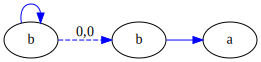
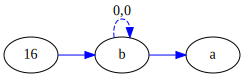
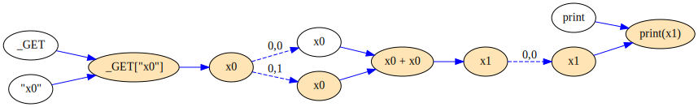
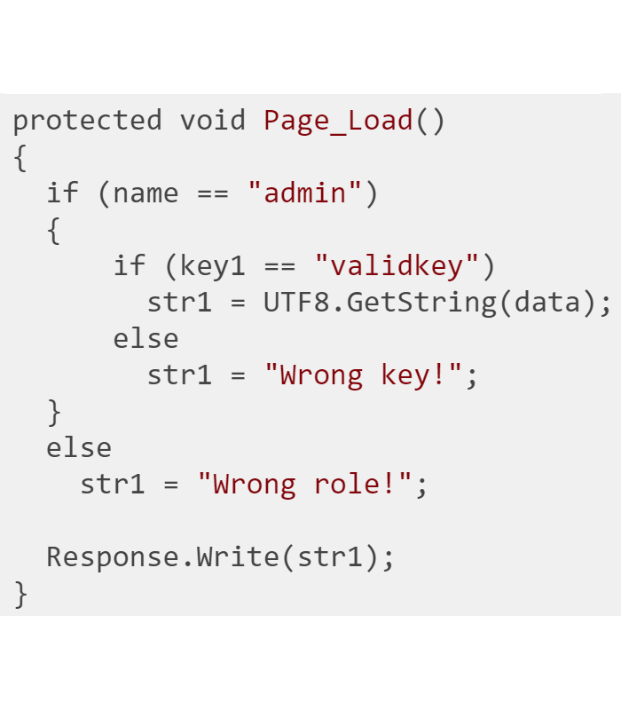

<link href="pdug-begin.png">
<link href="css/theme/black.css">
<link href="css/theme/white.css">
<link rel="icon" href="favicon.ico" type="image/x-icon" />

<style>
.reveal h1 {
    font-size: 1.3em;
    text-align: center
}
.reveal h2 {
    font-size: 1.2em;
    text-transform: none;
    text-align: center
}
.reveal h3 {
    font-size: 1.1em;
    text-transform: none;
    text-align: center
}
.reveal h4 {
    font-size: 1.0em;
    text-transform: none;
    text-align: left
}
.reveal section img {
    background: none;
    border: none;
    box-shadow: none;
    align: right;
}
.reveal .slides code:not([class]) {
    background: rgba(27,31,35,0.05);
    font-family: consolas;
}
.common-tokens {
    background-color: #ffff00
}
.island-tokens {
    background-color: #cccccc
}
.good-tokens {
    background-color: #66ff66
}
.bad-tokens {
    background-color: #ff0000;
    color: #ffffff"
}
</style>

<!-- .slide: data-background="pdug-begin.png"; width="100%" style="text-align: left;" -->

<div style="position:absolute; left:45%; width: 65%; text-align: left; color: #ECE9D7; font-size: 1.25em;">

<br><br>
Source code analyzers:<br>how generalizable are they?

<br><br>

<div style="font-size: 0.8em;">

Ivan Kochurkin<br>

Positive Technologies<br>

Team Lead
</div>

<br>

<span style="position:absolute; left:-15%; font-size: 0.5em;">
Theme: <a href="#" onclick="document.getElementById('theme').setAttribute('href','css/theme/white.css'); return false;">White</a> |
<a href="#" onclick="document.getElementById('theme').setAttribute('href','css/theme/black.css'); return false;">Black</a></span>
</div>

---

# About me

* Ivan Kochurkin
* Team Lead at [Positive Technologies](https://www.ptsecurity.com/ru-ru/), Data Flow Source Code Anaylzer Team
* Developer at [Swiftify](http://swiftify.io/), Objective-C → Swift Source Code Converter
* Arctive Contributor at GitHub: [KvanTTT](https://github.com/KvanTTT)
* Tech Article Writer at [habr.com](https://habr.com/users/kvanttt/) and other blogs

<aside class="notes">
Меня зовут Иван Кочуркин. В настоящий момент я работаю в Positive Technologies
над такими универсальными анализаторами: сигнатурным и анализатором потока данных.

Также я участвую развитии Swiftify, веб-сервисе по конвертации кода Objective-C
в Swift. Там я занимаюсь доработкой Objective-C грамматик, конвертером и
улучшением производительности.

Наконец, я веду активную деятельность на GitHub под ником KvanTTT и пишу статьи
на хабре на техническую тематику.
</aside>

---

# Analyzer Types

1. Regular Expressions
2. Tokens
3. Parse Trees and AST
4. Data & Control Flow Graphs (DFG & CFG)
5. Abstract interpretation
6. Binary | Intermediate Language

<aside class="notes">с
Сначала немного разъясню название доклада: под обобщением подразумевается анализ
разных языков, таких как C#, Java, PHP, даже SQL диалектов с использованием
универсального представления.

Вот вы сами как думайте, можно ли?

* Кто считает что да?
* Кто считает что нет?

Я же скаже по своему скромному опыту скажу, что чем глубже и сложнее анализатор,
тем больше в нем конкретной специфики и тем сложнее алгоритмы. Для того, чтобы
рассмотреть этот вопрос подробно, я разбил модели исходного кода на следующие типы:
регулярные выражения, токены, дерево разбора или абстрактное синтаксическое дерво,
графы потока данных и управления, абстрактная интерпретация и, наконец, бинарный
язык или промежуточное представление.

Регулярные выражения, напримерв, вообще не требуют промежуточной модели, они
работают на тексте. Да и вообще они могут исопльзоваться для обработки не только
языков программирования. Для анализатора на токенах требуется разбиение текста
на лексемы или токены. Однако список токенов - это линейная структура. Это уже
является определенной моделью, которую необходимо унифицировать. Дерево разбора
или абстрактное синтаксическое дерево - уже иерархическая, древовидная структура.
А следующие структуры вообще графовые, причем они содержат циклы, которые
усложняют и увеличивают время анализатора. И, наконец, абстрактная интерпретация в свою
очередь требуют проработанную семантическую модель исходного кода. А анализ
бинарного представления - вообще требует чтобы код запускался на реальном окружении,
причем в контексте самой операционной системы.
</aside>

---

<!-- .slide: data-background="#222222" -->

# So, is it possible to generalize?


<aside class="notes">
Так все же возможно ли унифицировать анализатор кода?

В общем случае - нет и презентацию можно считать законченной. Но давайте
рассмотрим частные случаи, для каждого из которых я детально опишу каждый типа
анализатора кода, какие модели исходного кода в них используются, какие недостатки
и уязвимости они могут детектить и пофантазирую о том, как могли бы выглядеть
предметно-ориентированные языки под них, т.е. DSL? В докладе я буду акцентировать
большое внимание на DSL, пусть даже и абстрактном, потому что он хорошо отображает
сущности рассматриваемой модели.

Для лучшего закрепления материала, конечно, продемонстрирую все на конкретных
примерах, паттернах для каждой модели исходного кода.
</aside>

---

# Regular Expressions

1. `<table>(.*?)</table>`
2. Attributes? `<table.*?>(.*?)</table>`
3. Elements? `tr`, `td`
4. Comments? `<!-- html comment -->`
5. ...
6. [NO NOO̼O​O NΘ stop the an​*̶͑̾̾​̅ͫ͏̙̤g͇̫͛͆̾ͫ̑͆l͖͉̗̩̳̟̍ͫͥͨe̠̅s ͎a̧͈͖r̽̾̈́͒͑e n​ot rè̑ͧ̌aͨl̘̝̙̃ͤ͂̾̆ ZA̡͊͠͝LGΌ ISͮ̂҉̯͈͕̹̘̱ TO͇̹̺ͅƝ̴ȳ̳ TH̘Ë͖́̉ ͠P̯͍̭O̚​N̐Y̡ H̸̡̪̯ͨ͊̽̅̾̎Ȩ̬̩̾͛ͪ̈́̀́͘ ̶̧̨̱̹̭̯ͧ̾ͬC̷̙̲̝͖ͭ̏ͥͮ͟Oͮ͏̮̪̝͍M̲̖͊̒ͪͩͬ̚̚͜Ȇ̴̟̟͙̞ͩ͌͝S̨̥̫͎̭ͯ̿̔̀ͅ](https://stackoverflow.com/a/1732454/1046374)

<aside class="notes">
Итак, первый тип, регулярные выражения. Наверное, в этом зале все знают что это
такое и если их использовать для обработки реальных исходников, то можно вызывать
Ктулху и попасть в ад.

Рассмотрим такую регулярку с открывающим и закрывающим тегом table: `<table>(.*?)</table>`.
Данное выражение парсит не жадно текст до закрывающегося тега `</table>`.
Ок, все хорошо, все довольны. А что, если нужно добавить еще и обработку аттрибутов?
Ок, нет проблем используем из пункта 2: `<table.*?>(.*?)</table>`. А что если
дальше нужно добавить поддержку элементов `<tr>` и `<td>`, которые внутри себя
также могут содержать кучу тегов? Или, допустим, добавить поддержку комментариев
`<!-- html comment -->`. После определенного этапа вам не захочется вносить
изменения в это сложное регулярное выражение, и вы поймете, что здесь что-то не
так :)

Кстати, то же самое касается и парсинга любых языков, в котором есть вложенные
элементы, например простейшие блоки из фигурных скобок в C#.
</aside>

---

# Regex DSL

* `[ ]` - Matches a single character that is contained within the bracket.
* `[^ ]` - Matches a single character that is not contained within the brackets.
* `?` - Optional symbol
* `*` - Zero or more occurrences. `ab*c` matches `ac`, `abc`, `abbc`
* `+` - One or more occurrences.
* `|` - Or. `gray|grey` can match `gray` or `grey`.

<aside class="notes">
Я думаю что ни для кого не секрет что из себя представляют DSL для регулярок.
Символы, которые нужно сматчить, задаются внутри квадратных скобок. Для того,
чтобы сделать отрицания - нужно использовать символ Карет или Циркумфлекс.
Чувствуйте, я уже произношу слова как из какого-то заклинания для вызова Ктулху?

Для выражений можно использовать разные квантификаторы, типа звездочки `*` или `+`,
которые обозначают ноль или один и больше повторов предыдущего выражения. Или,
например, можно использовать вертикальную палочку, которая обозначает выбор из
двух вариантов.

Также с помощью регулярных выражений можно описывать группы, которые можно
использовать при замене одних строчек на другие.

Вообще говоря регулярки в современных языках программирования обладают мощностью
полноценных языков благодаря обратным ссылкам и другим фичам. Однако описывать
ими конструкции с определенного этапа становится очень сложно.

Почему описание регулярных выражений и этот слайд здесь вообще существуют? Дело
в том, что последующие DSL являются надмножеством предыдущих и содержат
дополнительные синтаксические конструкции. Т.е. язык для универсальных токенов,
например, будет также в каком-то виде содержать повторы, или и другие операторы.
</aside>

---

# Regex Patterns

| Advantages                   | Disadvantages                                            |
|------------------------------|----------------------------------------------------------|
| Very simple                  | Hard to support                                          |
| Formal model is not required | In general not recursive                                 |
| Universal                    | Slow                                                     |
|                              | Hidden tokens (whitespaces, comments) can not be skipped |

<aside class="notes">
Подводя итоги по регулярным выражениям, можно сказать следующее:

Использовать их очень легко, для них даже не требуется никакого дополнительного
преобразования исходного кода. Кроме того, их можно использовать не только для
поиска интересующих строчек, но и для замены одних цепочек на другие.

Такая простота, однако, чревата большими сложностями при поиске чего-то менее
тривиального. Во-первых, регулярные выражения даже короткие тяжело воспринимать,
а большие - так вообще write-only.

Во-вторых, регулярки не подходят для парсинга рекурсивных структур, которыми,
например, являются открывающиеся и закрывающиеся фигурные скобки в языках
программирования, ну и другие структуры.

В-третьих, сложные регулярные выражения могут довольно долго отрабатывать, т.к. нужно
учитывать пробелы и другие незначимые токены. Кстати, это тоже тоже является
проблемой, т.к. в регулярках нельзя просто взять и забить на пробелы. Если у вас
между двумя строками есть пробелы, то надо их всегда указывать. Это также захламляет
и без того сложное регулярное выражение. А если есть несколько регулярок, то
нужно прогонять текст несколько раз.
</aside>

---

# Regex Patterns

* Floating Point Numbers: `[-+]?[0-9]*\.?[0-9]`
* EMails

  ```
  `\b[A-Z0-9._%+-]+@[A-Z0-9.-]+\.[A-Z]{2,}\b`
  ```

* IP Address Find | Validation

<aside class="notes">
На этом слайде показаны некоторые примеры регулярок. Простейшим является поиск
вещественных чисел.

Конечно же все наверное видели подобие регулярного выражения для парсинга
адресов электронной почты. В стандарте на самом деле оно выглядит куда более
громоздко, хотя и эта запись уже плохо читается. Однако надеюсь также все понимают,
что с помощью только регулярного выражения нельзя отвалидировать почту, потому
форматов очень много, у разных серверов разные ограничения. Так что самый
надежный способ проверить email - отправить тестовое письмо и удостовериться, что
оно дошло.

Также с помощью регулярок можно валидировать IP адреса, даты. Но даже такое
выражение для IP будет занимать слишком много места и, поверьте, здесь будет
лишним.
</aside>

---

<!-- .slide: style="text-align: left;" -->

# Tokens

* Lexeme - Recognized char sequence
* Token = Lexeme + Type
* Grammar

    ```
    Keyword:    'var';
    Id:         [a-z]+;
    Digit:      [0-9]+;
    Comment:    '/*' .*? '*/';
    Semi:       ';';
    Whitespace: ' '+;
    ```
* Code Sample
    ```csharp
    var a = 17; /* comment */
    ```

<aside class="notes">
Однако последнюю проблему можно решить если перейти на следующий уровень, в
котором анализатор оперирует уже не отдельными символами, а группами символов,
которые обозначают ключевые слова, числа, строки, пробелы и т.д. В этом случае
пробелы и комментарии можно сразу отбразывать если они не нужны.

Эти группы символов называются **лексемами**, а **токеном** является лексема с
ее типом. Процесс создания токенов из текста называется **токенизацией**.
Значительным преимуществом набора работы с токенами по сравнению с регулярками
является то, что токенизация проводится один раз и дальнейший поиск уже можно
производить по типам токенов, а не по всем символам текста.

Кстати, токенизаторы можно писать вручную и генерировать. В случае генерации
входным файлом является грамматика, фрагмент которой продемонстрирован чуть выше.
Например из секции *Code Sample* для соответствующей грамматики
первым токеном будет являеться `Keyword`, следующим - пробел, далее - идентификатор,
пробел, знак равенства, пробел, число, точка с запятой, пробел и, наконец,
комментарий.

Наиболее распространенным генератором лексеров на сегодня являются ANTLR и flex.
ANTLR, кстати, является еще и генератором парсеров и для него существует
наверное самая большая коллекция грамматик (более 100 штук), которая активно
дорабатывается сообществом. Но его я позже еще коснусь, а пока пофантазируем о
том, что из себя может представлять универсальный DSL, основанный на токенах.
</aside>

---

<!-- .slide: style="text-align: left;" -->

# Token DSL Example

Regex + Additional Syntax

* `<[regex]>` - Id token by custom regex
* `<"regex">` - String by custom regex
* `<(begin..end)>` - Numbers (range)
* `</*regex*/>` - Comments by custom regex

<aside class="notes">
Если регулярные выражениях в принципе оперируют только отдельными символами, то
анализаторы на токенах уже оперируют типами токенов. Поэтому целесообразно
обозначать маркерами эти типы токенов. Я уже знаю что вы хотели бы спросить, что
это за маркеры должны быть? С одной стороны, это должны быть уникальные символы
или последовательности, которые гарантировано не встретятся в исходных кодах.
С другой - они должны быть достаточно короткими, чтобы не тратить много времени
на их печатЬ, ну и чтобы наш DSL выглядел лаконично.

Я разработал следующие обозначения. Каждый токен ообособляется открывающимся и
закрывающимся маркером. Маркер состоит из двух символов. Первый - треугольная
скобка, второй - квадратная скобка, кавычка, треугольная скобка, либо слэш со
звездочкой. Вот собственно они продемонстрированы на слайде.

Соответственно для идентификатора можно будет использовать любое регулярное
выражение не содержащее подряд идущих "квадратную скобку и знак больше". Не думаю что вы
когда-нибудь видели такие идентификаторы. Однако если даже символы маркера
встрется внутри токена, их можно будет экранировать. Такое может случиться
внутри регулярных выражний - строк.

Для чисел обычно исопльзуются диапазоны. Причем возможны и "бесконечные" диапазоны
(на самом деле, конечно, ограниченные разрядностью 32- и 64-битных чисел).

По-умолчанию комментарии и пробелы не должны учитываться лексическим анализатором,
однако при необходимости и их можно учесть с помощью последнего обозначения.
Как это сделать? Использовать треугольную скобка + обычный маркер многострочного
комментария.

Помимо типов токенов, в Token DSL возможны и привычные из Regex квантификаторы,
такие как `*`, `+`, `?` и другие. Как видим, универсальные токены выглядят
довольно интуитивным образом, лаконичны, но, с другой стороны, обладают
достаточной выразительной мощностью.
</aside>

---

# Token Patterns

Simple, but still not recursive (in common)

* `<[password]> = <"">`
* `</* password\s*=\s*"god" */>`
* `<[md5|sha1]>(`
* `<"(?i)select\s\w*"> + <~> <"\w*">`

---

<aside class="notes">
На этом слайде представлены несколько примеров, которые можно описать с помощью
предложенного DSL.

Первые два - жестко заданные пароли. Слева может стоять переменная, содержащая
слово `password`, справа - любой токен типа string. Второй паттерн предназначен
для поиска жестко-заданных паролей в комментариях.

Третий паттерн позволяет находить вызовы функций, содержащих слова `md5` или `sha`,
т.е. небезопасные функции хеширования. Скобка нужна для того, чтобы анализатор
понял, что это именно вызов функции, а не произвольные идентификаторы. Т.к. на
уровне токенов все еще не поддерживается рекурсия, как и с регулярками, то такой
DSL все же достаточно ограничен и костылен.

И, наконец, последним примером является простая SQL инъекция, которая начинается
со строки `select` и конкатенируется с любым не строковым типом.

Понятное дело, что анализаторы на токенах будут детектить много ложных срабатываний
или, наоборот, не находить реальных угроз, однако набор токенов - это все равно
очень простая модель, которую тоже легко получить.

С другой стороны, дополнительным плюсом токенов является линейное представление.
А это значит, что, например, если кто-то захочет обучать нейронную сеть, то на
таком наборе токенов ее обучать будет легче, чем, например, на рассматриваемых
деревьях и других более сложных структур.
</aside>

<!-- .slide: style="text-align: left;" -->

# A error in code due to the error in parser?

#### Grammar

```
Identifier: [A-Za-z]+
```

#### Wrong

```sql
add constraint С_PK primary key (ID);
```

#### Right

```sql
add constraint C_PK primary key (ID);
```

<aside class="notes">
Расскажу об одном забавном случае, как мы однажды нашли недоразумение в коде
благодаря ошибке в грамматике, парсере. Посмотрите на эти два случая выше и
подумайте, что в них может быть не так? Вы можете подумать, что они абсолютно
одинаковые и я либо опечатался, либо просто несу какую-то чушь.
Есть идеи, что здесь может быть не так?

Ну на самом деле просто напросто в первом случае используется русская "С", а во
втором - обычная, латинская! :) Конечно, может у разработчиков была какая-то
своя логика, но на мой взгляд такой код со смешением символов из разных
культур только вносит путаницу.
</aside>

---

<!-- .slide: style="text-align: left;" -->

# Text fingerprinting with zero-length characters

Be c​aref​ul wh​at yo​u copy: In​visib​​ly inserting user​names into text​ with Zero-Width Characters​

<span class="fragment">http://diffchecker.com</span>

<span class="fragment">
Be c•aref•ul wh•at yo•u copy: In•visib••ly inserting user•names into text• with Zero-Width Characters•
</span>

<aside class="fragment" align="middle">Detail: 
[habr.com](https://habr.com/post/352950/) | [Medium](https://medium.com/@umpox/be-careful-what-you-copy-invisibly-inserting-usernames-into-text-with-zero-width-characters-18b4e6f17b66)
</span>

<br>

<aside class="notes">
Есть и другая похожая забавная история с символами, но только уже нулевой длины.
Например, в эту строку я вставил 10 таких символов. Не верите? Можете сами
в этом убедиться с помощью сервиса <https://www.diffchecker.com>.
Эти символы можно использовать как уникальные "отпечатки" текста для
идентификации пользователей. С помощью этого способа, например, можно поиграть в
разведчика: в копируемое сообщение закодировать имя пользователя и понять,
кто сливает какую-то конфиденциальную инфу и кто недостаточно параноидальный :)

Вообще это реальная история, подробней о ней вы можете почитать на хабре и
медиуме.
</aside>

---

# [Lib Protection](https://github.com/LibProtection)

```csharp
var a = Request.Params["a"];
var b = Request.Params["b"];
Response.Write($"");
```

<table style="font-size: 0.6em">
  <tr>
    <td>Good :)</td>
    <td>Bad :(</td>
  </tr>
  <tr>
    <td>
      <span class="common-tokens"><</span> <span class="common-tokens">img</span> <span class="common-tokens">src</span> <span class="common-tokens">=</span> <span class="common-tokens">'</span> <span class="island-tokens">//</span> <span class="island-tokens">host</span> <span class="island-tokens">/</span> <span class="island-tokens">1</span> <span class="island-tokens">/</span> <span class="good-tokens">image.jpg</span> <span class="common-tokens">'</span>
    </td>
    <td>
      <span class="common-tokens"><</span> <span class="common-tokens">img</span> <span class="common-tokens">src</span> <span class="common-tokens">=</span> <span class="common-tokens">'</span> <span class="island-tokens">//</span> <span class="island-tokens">host</span> <span class="island-tokens">/</span> <span class="island-tokens">1</span> <span class="island-tokens">/</span> <span class="bad-tokens">'</span> <span class="bad-tokens">onerror</span> <span class="bad-tokens">=</span> <span class="bad-tokens">'</span> <span class="bad-tokens">alert</span> <span class="bad-tokens">(</span> <span class="bad-tokens">0</span> <span class="bad-tokens">)</span> <span class="common-tokens">'</span>
    </td>
  </tr>
</table>

### Correct

```csharp
Response.Write(SafeString<Html>.Format($" ... "));
```

<aside class="notes">
Напоследок расскажу коснусь немного библиотеки **Lib Protection** моего коллеги Владимира Кочеткова.
Она также же работает на уровне токенов.

Смысл заключается в детектировании опасных данных, пришедших из внешней среды
(точек входа) и использующихся в потенциально опасных функциях (точках выхода).

В примере на слайде токены, относящиеся к основной грамматике (HTML) отмечены желтым цветом,
к островным грамматикам - серым (file path). Зеленым и красным цветом отмечаются токены
из входных данных. Библиотека токенизирует исходные данные и подсчитывает
количество токенов в точках инъекций. Если результирующих токенов больше одного,
то код считается опасным. На слайде
продемонстрирован пример внедрения скрипта через картинку. На самом деле в этой
библиотеке еще есть нюансы с авторизированными токенами, типами грамматик
и другие интересные вещи, но об этом вам расскажет Владимир завтра на докладе
"LibProtection: 6 месяцев спустя".
</aside>

---

# Parse Tree

* **Parse Tree** - tree structure obtained from tokens sequence.
* **AST** - Abstract Syntax Tree, i.e. parse tree without spaces, semicolons and other not significant tokens.


<aside class="notes">
Давайте перейдем к следующему типу анализаторов, которые оперируют древовидными
структурами, а именно деревьями разбора и абстрактными синтаксическими деревьями
(AST).

Кто знает разницу между этими двумя понятиями?

В нём отсутствуют узлы и рёбра для тех синтаксических правил, которые не влияют
на семантику программы, например, группирующие скобки, пробелы и комментарии.

Как думаете, всегда ли для анализа исходников нужно AST или все же с помощью
дерева разбора также можно детектировать какие-то дефекты в исходном коде?
Ответ заключается в том, что часть информации и правда теряется, но вы думайте
где это может использовать, к этому вопросу мы вернемся чуть позже.

А я пока что расскажу о достоверном дереве разбора, а именно таком дереве, которое
может быть преобразовано или *антипаршено* обратно в код символ в символ, причем
с любым количеством ошибок. Как это сделать, если пробелы и комментарии вообще
не являются узлами дерева, в отличие от тех же скобок? Для этого в некоторых
движках синтаксического разбора, используется концепция *основных*,
*лидирующих* и *замыкающих* токенов.
</aside>

---

# ANTLR Parser Generator


### [grammars-v4](https://github.com/antlr/grammars-v4)

* [PHP](https://github.com/antlr/grammars-v4/tree/master/php), [JavaScript](https://github.com/antlr/grammars-v4/tree/master/javascript), [T-SQL](https://github.com/antlr/grammars-v4/tree/master/tsql)
* [Java](https://github.com/antlr/grammars-v4/tree/master/java), [PL/SQL](https://github.com/antlr/grammars-v4/tree/master/plsql), [MySQL](https://github.com/antlr/grammars-v4/tree/master/mysql)

<aside class="notes">
Как я уже говорил, ANTLR может генерировать не только лексеры, но и парсеры. Он
принимает на вход контекстно-свободную грамматику и возвращающий
парсер на целевом рантайме. Сейчас поддерживается довольно много рантаймов:
Java, C#, Python 2|3, JavaScript, C++, Go, Swift. Грамматика описывается в виде
в расширенной форме Бэкуса-Наура (EBNF).

Наша компания Positive Technologies внесла большой вклад в развитие грамматик.
В частности, нами были разработаны грамматики PHP, JavaScript, T-SQL и
существенно доработаны грамматики C#, Java, PL/SQL, MySQL. Сейчас этими
грамматиками много кто пользуется и дорабатывает.
<aside>

---

# Leading & Trailing Tokens

* **Node** - Not terminal not with children
* **Token** - Terminal node (keyword, id, literal, etc.)
* **Trivia** - Node without parent, but linked with `Token`.
  * **Leading**
  * **Trailing**

```CSharp
// leading 1 (var)
// leading 2 (var)
var foo = 42; /* trailing (;)*/ int bar = 100500; // trailing (;)

// leading (EOF)
EOF
```

<aside class="notes">
Одним из примеров таких движков является Roslyn - не просто парсер, а полноценный
инструмент для парсинга, анализа и компиляции C# и Visual Basic кода.

**Node** - по сути является нетерминальным (т.е. не конечный) узлом, который хранит в себе
несколько других узлов и отображает определенную конструкцию.

**Token** - это терминальный узел дерева, значимый токен. Представляет ключевое
слово, идентификатор, литерал или пунктуацию. Например, число `42` или `;`.

А вот **Trivia** - более интересный токен, представляющий комментарии, пробелы
и другие скрытые токены. Он не является узлом дерева, однако связывается с его
токенами. Вот как раз такие узлы оказываются незаменимыми при трансформации дерева
обратно в код (например, при рефакторинге). Сами тривии могут быть
**лидирующими** (*Leading*) и **замыкающими** (*Trailing*).

Во множество замыкающих попадают все тривии на той же самой строчке от
значимого токена до следующего значимого токена. В примере это комментарии
traiking. Все остальные скрытые токены после рассматриваемого попадают во
множество лидирующих и связываются со следующим значимым токеном. В примеры
это комментарии leading. Первый значимый токен содержит в себе начальные
тривии файла. Скрытые токены, замыкающие файл, связываются с последним
специальным end-of-file токеном нулевой длины.

Таким образом можно связывать все-все незначимые токены со значимыми.
</aside>

---

<!-- .slide: style="text-align: left;" -->

# Parse Tree DSL

Parse Tree DSL = Tokens DSL + Additional Syntax

* Invocation: `method_name(expr (',' expr)*)`
* Pattern operators: `<&>`, `<|>`, `<~>`.
* Member reference expression: `target.name`
* Try Catch Block: `try {...} catch { }`

<aside class="notes">

</aside>

---

<!-- .slide: style="text-align: left;" -->

# Parse Tree Patterns

### Empty try catch block (All)

```csharp
try
{
   // multiple statements
}
catch { }
```

### Insecure SSL connection (Java)

```php
new AllowAllHostnameVerifier(...) <|>
SSLSocketFactory.ALLOW_ALL_HOSTNAME_VERIFIER
```

### Cookie Without Secure Attribute (PHP)

```php
session_set_cookie_params(#, #, #)
```

<aside class="notes">
Рассмотрим, какие же паттерны можно описывать с помощью

Последний паттерн, Cookie Without Secure Attribute демонстриует вызов метода по
небезопасной сигнатуре. В этом примере четвертый аргумент отвечает за флаг безопасности.
</aside>

---

# Parse Tree Patterns (SQL)

## Grant All

```dsl
grant_all(...)
```

```sql
GRANT ALL ON employees TO john_doe;
```

## Comparison with `null` through `==`

```dsl
# == null <[||]> # != null
```

<aside class="notes">
На этом слайде показано как можно использовать DSL даже для декларативных языков
таких как SQL диалекты (T-SQL, PL/SQL и других).

Первый - сравнение с `null`. По спецификации результат такого сравнения - неопределенность.
Второй - предоставление чрезмерно расширенных полномочий. Стоит заметить, что, несмотря
на то, что `GRANT ALL` является запросом, в движке сопоставления это
преобразовывается именно в вызов функции.
</aside>

---

# Data Flow Graph (DFG)

```csharp
if (cond)
    a = 1;  // a - def
else
    a = 2;  // a - def
b = a + 42; // b - def (2), a - use (2)
c = b;      // b – use, c - def
c = b * 17; // b – def, c – use
```

### Graph


### Text

```
{1→a | a←2} → a → a+42 ← 42 → b → {b → c | b → b*17 ← 17 → c}
```

<aside class="notes">
Перейдем к следующей модели представления кода, а именно к графу потока данных
(DFG). Это последовательность данных и преобразований над ними, которая начинается
с точки входа и заканчивается точкой выхода. Поток данных для одного элемента
данных представляет собой цепочку вершин, а поток, включающий в себя все данные
приложения - совокупность связанных между собой цепочек, а именно ациклический граф.
Вершины, в которых происходит соединение потоков данных, называются *преобразованиями*.

Давайте поменьше теории и побольше практики:
На этом слайде продемонстрирован пример кода и построен Data Flow Graph к нему.
`Def` или `Definition` узлами называются узлы, в которых приоисходит
инициализация данных. Кстати, данные - это элемент памяти, в которую возможно
записывать, изменять и считывать значение во время выполнение программы.
Локальные переменные, поля класса, а также литералы (константные строки, числа
и другие значения) также являются данными, но только для чтения. `Use` - узлы,
в которых данные используется.

Как видим, `use` может иметь несколько `def`. В данном случае это `а` - она
определяется в двух блоках инициализации и используется затем при рассчете `b`.
Также `def` может иметь несколько `use`. В данном случае это как раз `b` - она
инициализируется в пятой строчке и используется затем при рассчете `c`.

Помимо графического представления, DFG граф можно представлять и в текстовом
виде, как это продемонстрировано внизу слайда. Здесь есть прямые и обратные
стрелки, которые соответственно обозначают прямой и обратный потоки данных.
Обратным потоком называется поток, вершины которого достигаются при обходе DFG
в направлении, противоположным исполнению программы. Также присуствует
вертикальная черта, которая обозначает разветвление потока. Это происходит в том
случае, если def или use узлы имеют более одного дочернего (use или def) узла.
</aside>

---

# DFG & AST interaction

### Var initialization

```csharp
int b;
int a = b;
```



### Multi Assignment

```csharp
a = b = 16;
```



<aside class="notes">
К сожалению, DFG узлы не всегда однозначно соответствуют узлам дерева разбора или
AST. Например, в некоторых случаях можно просто объявить переменную без инициализации
как в первом примере. На самом же деле инициализация скрытая есть (выделение
участка памяти в C++ или дефолтное значение в C#), но она скрытая. В данном случае
можно создать искусственый узел Use со специальной пометкой об инициализации,
который в свою очередь будет связан с AST для Def. Как это выглядит на графе вы
сами можете увидеть.

Второй случай - это когда переменная может одновременно являться как def-узлом,
так и use. В этом случае также понятно как поступать и таким узлом является b.
</aside>

---

# DFG & AST Interaction

## Conditional operator

```csharp
int a = 1;
int b = 2;
int d = 3;
int e = c1 ? (c2 ? a : b) : d;
```


<aside class="notes">
И, наконец, последний пример, условный оператор. С одной стороны он является
выражением, а с другой - в нем происходит разветвление потока данных. В DFG для
такого случая должен создаваться специальный узел с двумя потоками. Однако в
конечном итоге этот узел связывается с def узлом и удаляется.
</aside>

---

# Conditional expressions

## PHP conditional

```php
echo (true ? 'true' : false ? 'true2' : 'false2');
```

## C\# conditional

```csharp
Console.Write(true ? "true" : false ? "true2" : "false2");
```

* PHP result? <span class="fragment">`true2`</span>
* C# result? <span class="fragment">`true`</span>

<aside class="notes">
Стоит добавить, что в различных языках приоритет операций внутри условного
оператора может различаться. Это также необходимо учитывать при построении графов
и анализе.

Как думайте, что выведется в консоле в первом и втором случаях?
Например, в PHP фрагмент кода на слайде выведет `true2`. А в C# - `true`. К счастью,
это разрешается уже на уровне AST.
</aside>

---

# DFG Patterns (XSS)

```php
<?php

$x0 = $_GET["x0"];

if ($cond)
    $x1 = $x0 . $x0;

print($x1);
```



<aside class="notes">
На этом слайде изображен пример простейшей Cross Site Scripting инъекции и
соответствующий граф для нее. Узлы с желтым фоном подсвечивают опасный поток.

Однако с помощью графов потоков данных нельзя проверять условия достижимости
(conditions). В данном примере - это `$cond`. Это, конечно, может повлечь за собой
большое количество false positive. Для того, чтобы их учитывать, необходимо
также анализировать граф CFG, о чем сказано ниже.
</aside>

---

# DFG Patterns (SQL Injection)

### Vulnerability

```php
$id = $_SESSION[ 'id' ];
$query  = "SELECT * FROM users WHERE user_id = '$id'";
$result = mysqli_query($query);
```

### No vulnerability (transform function)

```php
$id = $_SESSION[ 'id' ];
$query  = "SELECT * FROM users WHERE user_id = '$id'";

$query = mysqli_real_escape_string($query);

$result = mysqli_query($query);
```

<aside class="notes">
На этом слайде приведен упрощенные примеры. Обратите внимание, что во втором
случае уязвимость отсутствует из-за наличия трансформирующей функции `mysqli_real_escape_string`.

Много "эталонов" уязвимостей можно найти в проекте DVWA (Damn Vulnerable Web Application).
</aside>

---

<!-- .slide: style="text-align: left;" -->

# Data Flow Graph DSL

Data Flow DSL = Parse Tree DSL + Additional Syntax

* Indirect flow: **a <- b**

```
k = b;
c = k + 42;
a = c
```

* Direct flow: **a <-- b**

```
k = b;
c = k;
a = c;
```

* Flow variable: **a: <[regex]>**

* Type identifier: **<[[fully.qualified.name]]>**

* Flow Negation: **<~> a**

<aside class="notes">
А теперь давайте пофантазируем о том, как должен выглядеть DSL для паттернов,
которые будут использоваться в движке, работающем с потоком данных.

Я выделил два типа потоков: косвенные и прямые. В случае косвенного потока
объект может проходить через любые трансформирующие функции. Кстати, оператор
`+` и другие тоже можно рассматривать как функцию, поскольку во многих языках
есть перегрузка операторов. Ну и даже без нее такая операция как-то изменяет,
трансформирует поток. Косвенные потоки, понятное дело, могут использоваться
для отслеживания XSS уязвимостей и SQL инъекций. Понятное дело, что какие-то
функции вообще могут прерывать поток или санитизировать с помощью экранирующих
фукнций.

Идентификатор типа. Дело в том, что типы не совсем являются обычными
идентификаторами, т.к. для них требуется FQN, т.е. Fully Qualified Name запись.
Поэтому использовать для них обычных квантификатор с треугольной и квадратной
скобками нельзя. И вообще могут быть неявными, т.е. не прописаны в AST.

В прямом же потоке объект проходит строго через цепочку присваиваний. Такие
потоки полезны для описания, например, жестко-заданных паролей.

В общем случае обычное присваивание из Parse Tree DSL также можно рассматривать
как оператор потока данных.
</aside>

---

# Data Flow Patterns

## PHP XSS

```
a: <[]> = _GET[#];
<~> b: <[]> = htmlspecialchars(a, ...);
<[print|echo]>(b);
```

## C\# XSS

```
a: <[]> = <[[Request.Params]]>[#];
<~> b: <[]> = <[[System.Web.HttpUtility.HtmlEncode]]>(a);
<[[HttpResponse.Write]]>(b);
```

<aside class="notes">
На этом слайде показаны примеры конкретных DFG паттернов. В первом случае
инициализируется потоковая переменная `a`, которая при этом матчит любой идентификатор.
Точкой входа является функция `_GET`, принимающая любое выражение ну или другая
точка входа.

Конец паттерна - соответственно вывод входных данных с помощью функций `print`
или `echo`. Это называют точкой выхода или потенциально опасной операцией (PVF).
Посередине же - трансформирующая или фильтрующая функция `htmlspecialchars`, через
которую не должен пройти поток `a`. Т.к. трансформирующая функция создает новый
поток, то необходимо ввести новую переменную `b`.

На самом деле типичная уязвимость представляет собой общую точку входа и несколько
пар трансформирующая функция - точка выхода. Кто может назвать почему несколько пар?
А это из-за того, что различным PVF соответствуют различные фильтрующие функции.
Например, для SQLi PVF является `mysql_query`, а фильтрующая функция - `mysql_real_escape_string`.
Для Cross-site scripting потенциально опасной является `print`, а фильтрующей -
`htmlspecialchars`.

Следующий пример - уязвимость XSS, только уже под C#. В ней уже используется
обозначение типа FQN, поскольку C# язык со статической типизацией, т.е. информация
о типах известна на этапе компиляции.
</aside>

---

# C# Complex PVF TYPE

# DSL

```
<[[HttpResponse.Write]]>(b);
```

# Code

```csharp
var resp = this.Response; // Type: HttpResponse
resp.Write("some string");
```

<aside class="notes">
В процессе статической обработки DFG графа, с помощью алгоритма вывода типов можно
выяснить, что в послдней строчке переменная `resp` обладает типом `HttpResponse`.
</aside>

---

# Control Flow Graph (CFG)

<table>
<tr>
    <td></td>
    <td></td>
</tr>
</table>

<aside class="notes">
Представляет собой последовательность операций, как они выполняются в программе,
либо разветвление потока управления.

Всего есть два основным типа вершин: операция и разветвление. В данном примере,
например, операциями являются вызовы методов. Хотя сравнение и присвоение в
классическом понимании не являются операциями, они могут такими быть. Потому что
если спустится до инструкций ассемблера или виртуальной машины, то присвоение,
например, загрузка данных в регистр, а сравнение - вызов инструкии сравнения.
И даже константы можно рассматривать как какие-то операции - загрузка данных из
памяти.

Часто сами атомарные операции не важны, а важны только условия достижимости, т.е.
узлы из которых выходят ребра `true` и `false`.
</aside>

---

<!-- .slide: style="text-align: left;" -->

# CFG Patterns

Goto Fail Vulnerability

```c
hashOut.data = hashes + SSL_MD5_DIGEST_LEN;
hashOut.length = SSL_SHA1_DIGEST_LEN;

if ((err = SSLFreeBuffer(&hashCtx)) != 0)
    goto fail;
// ...
if ((err = SSLHashSHA1.update(&hashCtx, &signedParams)) != 0)
    goto fail;
    goto fail;  /* MISTAKE! THIS LINE SHOULD NOT BE HERE */
```

Detection methods

<span class="fragment">• Parse Tree<br></span>
<span class="fragment">• Control Flow Graph</span>

<aside class="notes">
На этом слайде демонстрируется нашумевший баг в библиотеки SSL [goto fail](https://nakedsecurity.sophos.com/2014/02/24/anatomy-of-a-goto-fail-apples-ssl-bug-explained-plus-an-unofficial-patch/),
Он заключался в том, что разработчики не убрали лишнюю строчку
из-за которой в алгоритме проверки подлинности пропускались какие-то шаги!

Интересно, что в данном конкретном случае данную уязвимость можно обнаружить
с помощью двух типов анализа. Как думайте, каких? Регулярки, токены, дерево разборы,
графы?

Ее можно обнаружить как с помощью анализа достоверного *дерева разбора*,
так и с помощью анализа *графа потока управления* (*CFG*).

Первым способом можно выяснить, что с дублирующемся утверждением `goto fail`
что-то не так: он вроде бы написан в родительском блоке, но при этом почему-то
сдвинут, в отличие от остальных утверждений, например `if`-ов. Здесь по-любому
что-то не так и нужно выводить предупреждение!

А с помощью анализе графа потока управления можно выяснить, что после `goto fail` идут
какие-то инструкции, которые никогда не выполнятся, ну т.е. на лицо недостижимый код.
Однако анализ таких графов более сложен.
<asied>

---

# Code property graph (CPG)

CPG = AST + DFG + CFG

<!-- TODO: image -->

<aside class="notes">
Представляет собой совокупность графов UST, CFG и CPG. По факту эта модель ничего
нового не вносит, просто связывает воедино все три модели, чтобы можно было
использовать удобные их свойства из любой точки программы. Ранее мы уже рассматривали
связку DFG + UST. А если добавить в это еще и CFG узлы, то станет возможным
фильтровать лишние потоки данных и, тем самым, уменьшать итоговое количество
ложных срабатываний.

Более того, такую модель можно оптимизировать и редукцировать какие-то узлы.
Это, конечно, не так-то просто, но зато эффективно. Т.к. какие-то фрагменты
CPG можно упростить независимо от внешних данных (статическая оптимизация), а
другие - в зависимости от внешних данных (динамическая). Впрочем, об этом будет
сказано чуть позже.

Вообще говоря редукция графов уже напоминают абстрактную интепретацию кода. Пока
что я углублюсь немного в детали, как можно приспособить модель ООП к плоской
модели для DFG и CPG.
</aside>

---

# CPG Object Model

```php
$a -> $page['title'] -> $b = 'text';
```


|              |  a  |  page  | 'title' |   b    |
| ------------ | --- | ------ | ------- | ------ |
| **token**    | id  | id     | string  | id     |
| **relation** | id  | member | indexer | member |

<aside class="notes">
Как уже было сказано ранее, любой движок taint-анализа оперирует плоскими или
линейными данными, а не иерархическими моделями. Однако доступ к таким можно
унифицировать.

Рассмотрим выражение на слайде.

Доступ к полю `$b` может быть унифицирован с помощью *типов* токенов и *отношений*
следующим образом.

Стоит отметить, что с помощью только статического анализа невозможно с точностью
разграничить понятия *выражений* и *данных*. Однако для большинства случаев
Taint анализатор будет работать удовлетворительно.
</aside>

---

# CPG Optimizations

* Static
  * Constant Propagation
  * Constant Folding
    * `2 + 2 * 2` → `6`
    * `"foo_" + "bar"` → `foo_bar`
* Dynamic
  * Overrides resolving
  * Overloads resolving

<aside class="notes">
Давайте рассмотрим какие оптимизации можно совершать над графом свойств кода для
более быстрого и лучшего анализа.

Прежде всего, оптимизации классифицируются на `статические` и `динамические`.

Статические не зависят от внешних данных. Таким образом, такую оптимизацию можно
провести один раз перед процессом поиска уязвимостей. Такими оптимизациями,
например, являются распространение констант и сворачивание констант. Кстати говоря,
сворачивание констант работает и на уровне деревьев разбора, однако т.к. в
исходных кодах часто константы объявляются в другом месте, то такой анализ будет
сильно ограничен.

Динамические оптимизации непосредственно уже зависят от входных данных, например,
когда когда в зависимости от них динамически создается объект определенного типа.
</aside>

---

# CPG Optimizations

## Overloads resolving

```csharp
Add(int x, int y) => x + y;
Add(string x, string y) => string.Concat(x, y);
...
Add(x, 2); // Static resolving succeeded: first method.
Add(x, y); // Static resolving failed.
```

## Overrides resolving

```csharp
if (cond)
    x = new A();
else
    x = new B();
Console.WriteLine(x.ToString()); // x ∈ A ∪ B
```

<aside class="notes">
Рассмотрим первый пример. Здесь у нас наглядный случай Ad hod или специального
полиморфизма, когда тело метода определяется во время динамики: соответственно
это либо сложение целых чисел, либо конкатенация строк. Однако, несмотря на то,
что тип `x` во время статики не известен, все же метод иногда можно полностью отресолвить
во время статического анализа. Например, в первом случае известен тип у второго
аргумента. Вопрос к залу, можно ли заресолвить второй случай? На на самом деле
"зависит от": не получится, если тип `y` зависит от внешних данных и получится,
если идентификатор `y` на самом деле является константой и была вычислена по
технике распространения констант. Кстати, для неопределенные типы можно помечать
определенным образом как `UnknownType`.

А вот во втором случае такой фокус уже не пройдет. Переменная `x` в конце фрагмента
кода будет содержать тип-объединение `A ∪ B`. Однако на этапе динамики, в
зависимости от условия, `cond` можно будет выбрать нужную ветвь исполнения кода и,
соответственно, конкретизировать тип. Вообще говоря, виновник всей этой динамики
и сложностей - полиморфизм.

Резюмирую, хочу отметить, что важен баланс между статикой и динамикой. Статический анализ
очень быстрый, но имеет много ложных срабатываний или, наоборот, находит не все.
Динамический же гораздо более мощный, однако в общем случае имеет экспоненциальную
сложность, а следовательно медленный и неопределенный, т.е. даже нельзя понять,
сколько операций нужно еще выполнить, чтобы выяснить, есть ли уязвмимость в коде
или нет.

О динамическом анализи и об абстракной интерпретации и так уже много докладов,
в том числе от Владимира Кочеткова. Так что подробно в нее я углубляться не буду.
</aside>

---

# Abstract Interpretation

<aside class="notes">

* State

</aside>

---

# Virtual Machine Instructions

## Tainted

```
mov eax, tainted_input
mov ecx, untainted_input
add ecx, eax ; ecx is TAINTED
```

## Untainted

```
mov eax, tainted_input
xor eax, eax ; eax is UNTAINTED
```

<aside class="notes">
Наконец, вместо всяких там дереьвев и графов можно просто анализировать бинарный
код или хотя бы промежуточное представление или IR (Intermediate Language).

Как правило, чтобы получить IR, необходимо чтобы проект полностью компилировался,
а это не всегда возможно, особенно для больших проектов. Кроме того, IR - это
дополнительный этап компиляции, который также нужно реализовывать. Это далеко
не всегда нужно. Другим недостатком является оторванность от исходного кода.
Ранее я уже говорил, что узлы графов DFG и CFG отображаются на универсальное AST,
которое, в свою очередь, отображается на дерево разбора. Но с бинарным кодом это
не работает, поэтому либо нужно мэппить текстспаны на инструкции виртуальной
машины, либо же отказаться от возможности точного расположения локаций в исходных
кодах.

Стоит отметить, что анализ потоков данных можно реализовывать и на бинарных
инструкциях виртуальной машины, что продемонстрировано на данном слайде.
Введу дополнительные понятия. `tainted` данными являются данные из опасного
источника. `untainted` - данные из безопасного источника или экранированные.

Например, в первом случае в регистр `eax` присваиваются какие-то опасные
данные. `ecx` же является untainted. Потом данные tainted регистра `eax`
переходят в регистр `ecx`, что, в свою очередь, делает данные регистр также
"тэйнченным".

А во втором случае приведен пример трансформирующей функции, которая в данном
случае просто обнуляет тэйнченный регистр eax.

Впрочем, об анализе бинарного кода рассказывал Константин Панарин в докладе
[О технологиях анализа бинарного кода приложений](https://www.youtube.com/watch?v=EMQYcOCvptE).
</aside>

---

<!-- .slide: style="text-align: left;" -->

# Turing Complete DSL

**Using**

* Implementation language (C#, Java, PHP, etc.)
* Universal actions

<aside class="notes">
Давайте теперь пофантазируем что может из себя представлять Тьюринг-полный DSL.
У кого есть идеи?

Правильно, тюринг-полный DSL - это сам код анализатора, ведь он имеет по сути
самый полноценный и удобный, поддерживается IDE и лишен багов, по крайней мере серьезных.

Стоит отметить, что такие вставки "полноценного" кода можно реализовать на
любых типах анализаторов и обозначать их также с помощью определенных маркеров.
</aside>

---

# Semantic Actions & Predicates

* ANTLR Universal Actions Language: <https://github.com/antlr/antlr4/issues/1045>

```
// Lexer
ID:  [0-9a-zA-Z];

// Parser
varDeclaration
    : id {_input.Lt(-1).Text == "var"}? id ('=' expr)? ';'
    ;

id
    : ID;
```

<aside class="notes">
В качестве примера можно привести предикаты и действия в генераторе парсеров
на основе грамматик ANTLR, о котором я уже упоминал пару раз.

Как известно, не все языковые конструкции охватываются только контекстно-свободными
грамматиками. Например, интерполируемые строки в C# или Heredoc строки из PHP
не охватываются ими из-за того, что для них требуется контекст.

Однако в генераторе парсеров ANTLR такие пробелмы можно решить с помощью вставок
кода на целевом языке, которые называются **действиями** (**action**) или
**семантическими предиктами**. Они используются в случае, если мощности
контекстно-свободной грамматики не достаточно для парсинга каких-то конструкций
или требуется выполнять какие-то инструкции во время парсинга. Обособляются они
фигурными скобками. Разница между действиями и предикатами заключается в том,
что последние должны возвращать какой-то результат и для них используется
вопросительный знак в конце. Вот так выглядит простейший пример использования
предикатов: проверяем, является ли предыдущий токен-идентификток строкой `var`,
и, если является, парсим правило дальше.
</aside>

---

# Implementation language

## [PT Pattern Matching (PT.PM)](https://github.com/PositiveTechnologies/PT.PM)

### Match Code

```csharp
// Pattern: <[.+]>
public override MatchContext Match(Token t, MatchContext c)
{
    Regex regex = t.Root.Language.IsCaseInsensitive
        ? caseInsensitiveRegex
        : this.regex;
    string text = t.TextValue;
    TextSpan textSpan = regex.Match(text).GetTextSpan(text);

    return !textSpan.IsZero
        ? c.AddMatch(t)
        : c.Fail();
}
```

<aside class="notes">
На этом слайде изображен пример паттерна, который используется сейчас в открытом
сигнатурном анализаторе кода PT.PM. Вообще говоря там все не так уж просто.

Всего есть три типа узлов: узлы UST (универсальное дерево разбора), паттерн-узлы,
которые обозначают обобщенный кусочек UST который нужно найти и match-узлы,
т.е. узлы, которые создаются во время
работы алгоритма сопоставления. Алгоритм пытается наложить паттерн на дерево
разбора и сохраняет результ в контекст `MatchContext`. В данном случае показан
фрагмент кода, который сопоставляет токены-id. Стоит отметить, что
все состояние алгоритма хранится в `MatchContext`, который может затем возвращаться.
Т.е. код написан в функциональном стиле.

Однако можно реализовать и другой паттерн-узел, который, например, будет проверять,
используются ли символы из разных культур в одном идентификаторе (rus и eng),
чтобы предотвратить ситуацию, которая описывалсь ранее, в которой
идентификатор полностью состоял из латинских символов за исключением одного
кириллического символа С, что очень путает.

Вообще говоря, если заморочиться, то логику сопоставления можно полностью вынести
в отдельную сборку и динамически ее подгружать, что, например, позволит сделать C#
</aside>

---

# Conslusion

* Several source code analyzer types has been described.
* Different models show different properties of program.
* More complex model -> less generalized analyzer.

<aside class="notes">
В докладе были рассмотрены различные типы анализаторов, принимающие на вход
регулярные выражения, токены, деревья разбора, графы потоков данных, управления
и бинарный код.

Было показано, что различные модели представления исходного кода отображают
различные свойства. Какие-то свойства могут теряться, если делать из одно модели
другую модель уровнем выше. Например, обычные отступы в дереве разбора могут
сигнализировать о неправильном формалировании, однако на уровне графов потоков
данных об этом выяснить не получится.

В конце концов было выявлено, что чем сложнее модель выполняемой программы, тем
сложнее разработать синтаксис описания ее узлов, а, следовательно, тем сложнее
ее унифицировать.

Ресурсы:
* 
* 
* 
</aside>

---

<!-- .slide: style="text-align: left;" -->

# We Are Hiring


<br>
**[Senior C# Developer (Algorithms, Compilers)](https://hh.ru/vacancy/24374136)**
<br>
<br>

## Responsibilities

* Data Flow Analyzer Development
* Alogorithms Implementation
* Languages and Vulnerabilities Research

<aside class="notes">
На правах рекламы расскажу о нашей открытой вакансии в группу разработки анализатора
потока данных.

Если вам понравился доклад, вы обладаете достаточным опытом, и у вас возникло
желание разбираться и разрабатывать все эти вещи - смело отправляйте резюме!
У нас дружный коллектив, удаленная работа и, самое главное, интересные задачи!
</aside>

---

<!-- .slide: data-background="pdug-end.jpg"; -->

<link href="pdug-end.jpg">

<span style="position:absolute; left:50%; top: 40%; color: #ECE9D7; font-size: 1.6em">THANKS!</span>

<br><br><br><br><br><br><br><br>

<span style="position:absolute; left:50%; color: #ECE9D7; font-size: 0.8em">Made using [reveal.js](https://github.com/hakimel/reveal.js/)</span>

<aside class="notes">
Вопросы?
<aside>

---